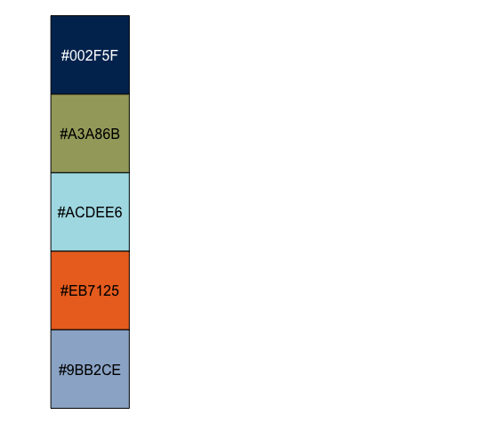
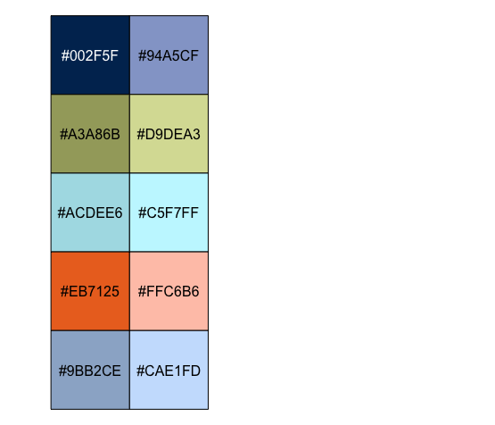
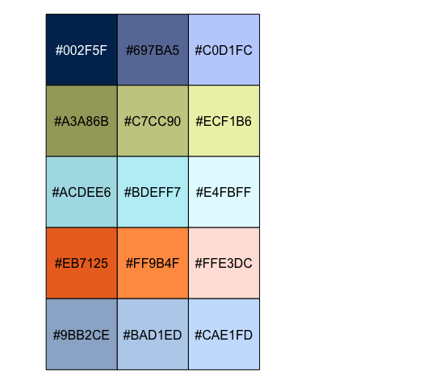
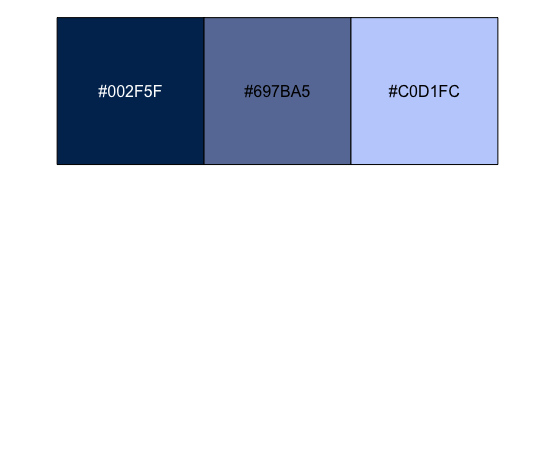
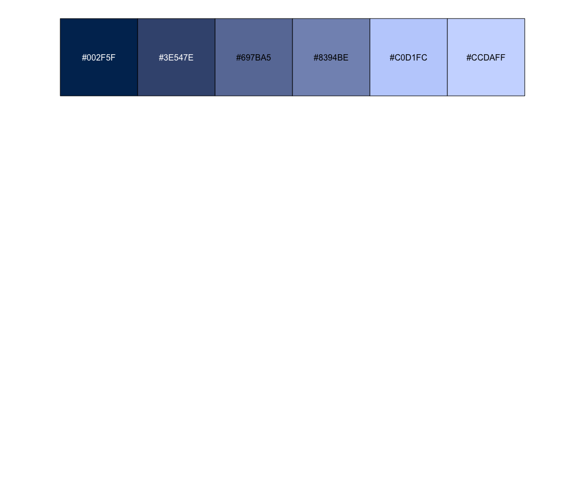
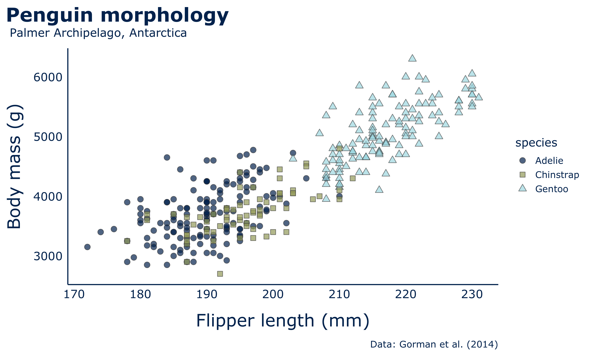
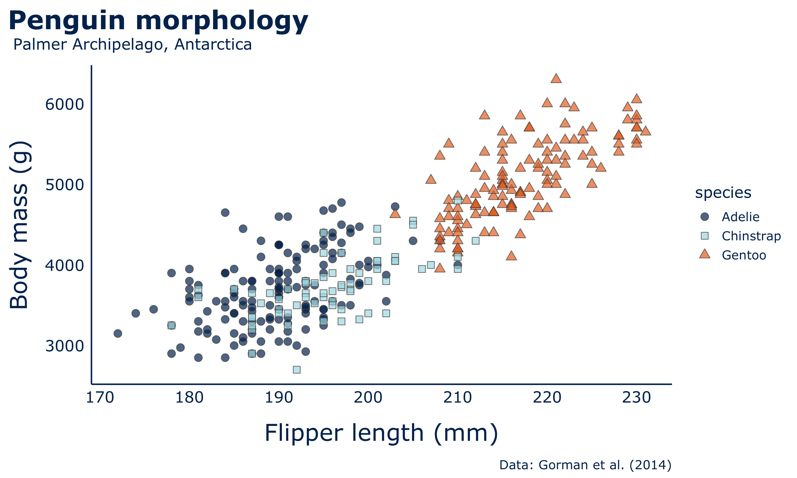

# ggsu

`ggplot2` theme following the [visual identity of SU](https://www.su.se/medarbetare/kommunikation/grafisk-manual)

## Install package

``` r
#install.packages("devtools")
devtools::install_github("borstell/ggsu")
library(ggsu)
```

## Color palettes

### Basic color palette
``` r
scales::show_col(su_palettes$su_basic, ncol=1)
```



### Expanded color palette
``` r
scales::show_col(su_palettes$su_expanded, ncol=2)
```



### All five available palettes
``` r
scales::show_col(
  c(su_palettes$su_dark,
    su_palettes$su_olive,
    su_palettes$su_sky,
    su_palettes$su_fire,
    su_palettes$su_water), 
  labels = TRUE, ncol = 3)
```



## Expand palettes
The `expand_palette()` function lets you add in-between colors to existing palettes
```r
scales::show_col(su_palettes$su_dark, ncol=3)
```


```r
scales::show_col(expand_palette(su_palettes$su_dark, amount = .2), ncol=6)
```



## theme_su
Draw plots with parameters conforming to the visual identity of SU

### Get [Palmer Penguins](https://allisonhorst.github.io/palmerpenguins/articles/examples.html) data for demo
```r
install.packages("palmerpenguins")
library(palmerpenguins)
library(dplyr)
library(ggplot2)

penguins %>%
  count(species, island, .drop = FALSE)
```

Plot some species observation data
```r
ggplot(penguins, aes(x = island, fill = species)) +
  geom_bar(alpha = 0.8) +
  scale_fill_manual(values = su_palette("su_basic"),
                    guide = "none") +
  labs(x="Island", 
       y="Observations", 
       title="Penguin species observed", 
       subtitle="Palmer Archipelago, Antarctica",
       caption="Data: Gorman et al. (2014)") +
  theme_su() +
  facet_wrap(~species, ncol = 1) +
  coord_flip()
```


Plot some correlations in penguin morphology (flipper length and body mass)
```r
ggplot(penguins, aes(x = flipper_length_mm, y = body_mass_g)) +
  geom_point(aes(fill = species,
                 shape = species),
             color="grey30",
             size = 3,
             alpha=.7) +
  scale_fill_manual(values = su_palette("su_basic")) +
  #scale_fill_manual(values = c(su_palette("su_basic")[1],su_palette("su_basic")[3:4])) +
  scale_shape_manual(values = c(21, 22, 24)) +
  labs(x="Flipper length (mm)",
       y="Body mass (g)",
       #fill="Species",
       title="Penguin morphology",
       subtitle="Palmer Archipelago, Antarctica",
       caption="Data: Gorman et al. (2014)") +
  theme_su()
```


Change palette manually for different colors
```r
ggplot(penguins, aes(x = flipper_length_mm, y = body_mass_g)) +
  geom_point(aes(fill = species,
                 shape = species),
             color="grey30",
             size = 3,
             alpha=.7) +
  #scale_fill_manual(values = su_palette("su_basic")) +
  scale_fill_manual(values = c(su_palette("su_basic")[1],su_palette("su_basic")[3:4])) +
  scale_shape_manual(values = c(21, 22, 24)) +
  labs(x="Flipper length (mm)",
       y="Body mass (g)",
       #fill="Species",
       title="Penguin morphology",
       subtitle="Palmer Archipelago, Antarctica",
       caption="Data: Gorman et al. (2014)") +
  theme_su()
```


